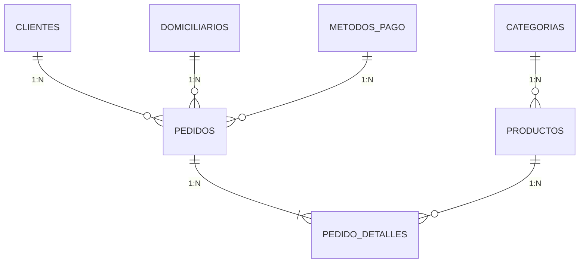

# QuickFood ERP &bull; Sistema de Gestión Empresarial para Dark Kitchen
## Corporación de Estudios Tecnológicos del Norte del Valle — COTECNOVA
### Seminario de Desarrollo de Aplicaciones Web en Laravel con Enfoque RAD (2026)

---

**Asignatura:** Software de Gestión Empresarial (SGE)  
**Proyecto:** QuickFood ERP  
**Giro:** Elaboración, preparación y comercialización de comidas rápidas y bebidas bajo el modelo de *Dark Kitchen* con servicio exclusivo de reparto a domicilio.  
**Repositorio GitHub:** [https://github.com/NiquelAwol/Dark-Kitchen.git](https://github.com/NiquelAwol/Dark-Kitchen.git)  
**Tecnologías:** Laravel 11/12, PHP 8.3/8.5, MySQL 8.4, Docker Desktop, Laravel Sail, Blade, Eloquent ORM, Tailwind CSS y Git.

---

## 1. Resumen Ejecutivo del Proyecto

**QuickFood ERP** es una plataforma web desarrollada a la medida para centralizar la operación interna de una empresa gastronómica de alta demanda. A diferencia de una simple página web comercial o menú digital, este ERP gestiona integralmente el ciclo neurálgico del negocio:

$$\text{Cliente} \longrightarrow \text{Pedido} \longrightarrow \text{Preparación} \longrightarrow \text{Listo (Empaque)} \longrightarrow \text{En camino (Domicilio)} \longrightarrow \text{Entrega y Recaudo}$$

### Ciclo de Estados del Pedido:
1. `Recibido`: Orden registrada con dirección confirmada y productos seleccionados.
2. `Preparando`: Plancha y cocina procesando la comanda.
3. `Listo`: Alimento empacado en bolsa térmica esperando recogida.
4. `En camino`: Domiciliario asignado en ruta de transporte con el producto.
5. `Entregado`: Producto entregado a satisfacción y cobrado al cliente.
6. `Cancelado`: Incidencia o cancelación (con reposición automática de stock).

---

## 2. Requisitos Previos

* **Docker Desktop** (con soporte WSL2 en Windows o Docker nativo en Linux/macOS).
* **Git** instalado.
* Opcional para desarrollo local sin Docker: PHP 8.3+ con extensiones `pdo_mysql`, `curl`, `mbstring`, `xml` y Composer.

---

## 3. Instalación y Puesta en Marcha con Docker y Laravel Sail

### Paso 1: Clonar el repositorio
```bash
git clone https://github.com/NiquelAwol/Dark-Kitchen.git "QuickFood ERP"
cd "QuickFood ERP"
```

### Paso 2: Configurar las Variables de Entorno
Copie el archivo de ejemplo si no existe el `.env`:
```bash
cp .env.example .env
```
Asegúrese de que la sección de base de datos apunte al contenedor de Sail:
```env
DB_CONNECTION=mysql
DB_HOST=mysql
DB_PORT=3306
DB_DATABASE=quickfood_erp
DB_USERNAME=sail
DB_PASSWORD=password
FORWARD_DB_PORT=3306
APP_PORT=80
```

### Paso 3: Iniciar los Contenedores con Laravel Sail
```bash
./vendor/bin/sail up -d
```
*(Los contenedores `quickfooderp-laravel.test-1` y `quickfooderp-mysql-1` iniciarán en segundo plano).*

### Paso 4: Generar la Clave de Aplicación (si es necesario)
```bash
./vendor/bin/sail artisan key:generate
```

### Paso 5: Ejecutar Migraciones y Poblado de Datos (Seeders)
Este comando creará las 7 tablas de negocio con sus restricciones e insertará **mínimo 10 registros coherentes por tabla**:
```bash
./vendor/bin/sail artisan migrate:fresh --seed
```

### Paso 6: Acceso al Sistema
Abra su navegador web e ingrese a:
* **URL del ERP:** [http://localhost](http://localhost) (o [http://127.0.0.1](http://127.0.0.1))
* **Usuario Administrador:** `admin@quickfood.local`
* **Contraseña:** `password123`

---

## 4. Ejecución de Pruebas Automatizadas (PHPUnit)

El proyecto incluye una suite de pruebas de integración y negocio (`tests/Feature/QuickFoodErpTest.php`) que certifica:
1. Existencia de mínimo 10 registros por tabla.
2. Relaciones directas e inversas (`hasMany` y `belongsTo`).
3. Funcionamiento de Scopes (`Producto::activos()`, `Pedido::pendientes()`, etc.).
4. Creación de pedido con cálculo de totales y decremento de inventario.
5. Transición operativa de estados.
6. Respuesta exitosa HTTP 200 de todas las vistas Blade.

Para ejecutar la suite:
```bash
./vendor/bin/sail artisan test
```
**Resultado certificado:**
```text
   PASS  Tests\Unit\ExampleTest
  ✓ that true is true

   PASS  Tests\Feature\QuickFoodErpTest
  ✓ minimum ten records per table                                        3.82s  
  ✓ eloquent relationships work bidirectionally                          0.28s  
  ✓ eloquent scopes filter correctly                                     0.18s  
  ✓ order creation calculates total and decrements stock                 1.19s  
  ✓ order status transitions                                             0.25s  
  ✓ dashboard and views response                                         0.67s  

  Tests:    7 passed (185 assertions)
  Duration: 13.47s
```

---

## 5. Arquitectura del Modelo de Datos (MER)



Para consultar la documentación técnica completa:
* **Análisis de Empresa y Procesos:** [`docs/analisis.md`](docs/analisis.md)
* **Diccionario de Datos:** [`docs/diccionario.md`](docs/diccionario.md)
* **Diagrama MER en Alta Resolución:** [`docs/diagrama_mer.png`](docs/diagrama_mer.png) y [`docs/diagrama_mer.md`](docs/diagrama_mer.md)

---

## 6. Modelos Eloquent y Scopes

* **`Categoria`:** `hasMany(Producto::class)`, scope `scopeActivas($query)`.
* **`Producto`:** `belongsTo(Categoria::class)`, `hasMany(PedidoDetalle::class)`, scopes `scopeActivos($query)`, `scopeConStock($query)`.
* **`Cliente`:** `hasMany(Pedido::class)`, scope `scopeActivos($query)`.
* **`Domiciliario`:** `hasMany(Pedido::class)`, scope `scopeActivos($query)`.
* **`MetodoPago`:** `hasMany(Pedido::class)`, scope `scopeActivos($query)`.
* **`Pedido`:** `belongsTo(Cliente::class)`, `belongsTo(Domiciliario::class)`, `belongsTo(MetodoPago::class)`, `hasMany(PedidoDetalle::class)`, scopes `scopePendientes($query)`, `scopeHoy($query)`, `scopeEntregados($query)`.
* **`PedidoDetalle`:** `belongsTo(Pedido::class)`, `belongsTo(Producto::class)`.

### Eager Loading (`with()`) para Eliminar Consultas N+1
En `PedidoController@index`:
```php
Pedido::with(['cliente', 'domiciliario', 'metodoPago', 'detalles.producto'])
    ->latest()
    ->paginate(10);
```

---

## 7. Guía Paso a Paso para la Sustentación Académica (10 Minutos)

Esta guía describe el guion exacto para presentar y sustentar el proyecto con éxito:

| Minuto | Paso | Qué Demostrar / Qué Decir |
| :---: | :--- | :--- |
| **0 - 1** | **1. Empresa Elegida** | Explicar que se eligió **QuickFood**, una *Dark Kitchen* ficticia de comidas rápidas artesanales enfocada en preparación bajo comanda y servicio a domicilio. |
| **1 - 2** | **2. Problema Identificado** | Cuellos de botella por órdenes en papel, descoordinación en ruta con domiciliarios, pedidos enviados a direcciones obsoletas y falta de control de stock en horas pico. |
| **2 - 3** | **3. Procesos Identificados** | Mostrar el flujo: Cliente ➔ Pedido (Recibido) ➔ Preparación (Cocina) ➔ Empaque (Listo) ➔ Despacho (En camino) ➔ Entrega y Cobro. Mencionando el módulo futuro de compras de insumos. |
| **3 - 4** | **4. Mostrar el MER** | Abrir [`docs/diagrama_mer.png`](docs/diagrama_mer.png) o [`docs/diagrama_mer.md`](docs/diagrama_mer.md). Explicar las 7 entidades de negocio, llaves primarias, foráneas y cardinalidad 1:N. |
| **4 - 5** | **5. Mostrar Migraciones** | Abrir la carpeta `database/migrations/`. Explicar las restricciones `cascadeOnDelete()`, `nullOnDelete()`, tipos de datos `decimal(12,2)` e integridad referencial. |
| **5 - 6** | **6. Mostrar Modelos y Relaciones** | Abrir `app/Models/Pedido.php` y `app/Models/Producto.php`. Enseñar las relaciones `belongsTo()`, `hasMany()`, y los Scopes (`scopePendientes()`, `scopeActivos()`). |
| **6 - 7** | **7. Mostrar Datos en MySQL** | Ejecutar en terminal: `./vendor/bin/sail mysql` y correr `SELECT 'categorias', count(*) FROM categorias ...`. Demostrar que todas las tablas tienen mínimo 10 registros coherentes y reales. |
| **7 - 8** | **8. Listado de Pedidos en el ERP** | Abrir el navegador en `http://localhost/pedidos`. Mostrar la tabla de pedidos, filtros por estado, paginación y explicar cómo el **Eager Loading** (`with(...)`) optimiza las consultas SQL. |
| **8 - 9** | **9. Crear un Pedido** | Ir a `http://localhost/pedidos/create`. Seleccionar cliente (ver cómo se autocompleta la dirección), agregar productos con cantidades (ver cálculo en tiempo real de subtotales y total), guardar la orden y verificar que se descontó el stock. |
| **9 - 9.5**| **10. Transición de Estados** | Abrir la comanda recién creada (`pedidos.show`). Presionar los botones de avance: `Recibido` ➔ `Preparando` ➔ `Listo` ➔ Asignar domiciliario ➔ `En camino` ➔ `Entregado`. |
| **9.5 - 10**| **11. Pruebas Automatizadas** | Correr `./vendor/bin/sail artisan test` en la terminal para demostrar que los 7 tests con 185 aserciones pasan en verde (100% aprobado). |

---

## 8. Comandos Útiles de Laravel Sail

* **Iniciar el entorno:** `./vendor/bin/sail up -d`
* **Detener el entorno:** `./vendor/bin/sail stop`
* **Entrar a la consola MySQL:** `./vendor/bin/sail mysql`
* **Entrar a Tinker:** `./vendor/bin/sail artisan tinker`
* **Ver logs en tiempo real:** `./vendor/bin/sail logs -f`
* **Reiniciar base de datos con datos de prueba:** `./vendor/bin/sail artisan migrate:fresh --seed`
* **Correr pruebas automáticas:** `./vendor/bin/sail artisan test`

---
*Desarrollado con dedicación y rigurosidad técnica para el Seminario RAD &bull; Cotecnova 2026.*
