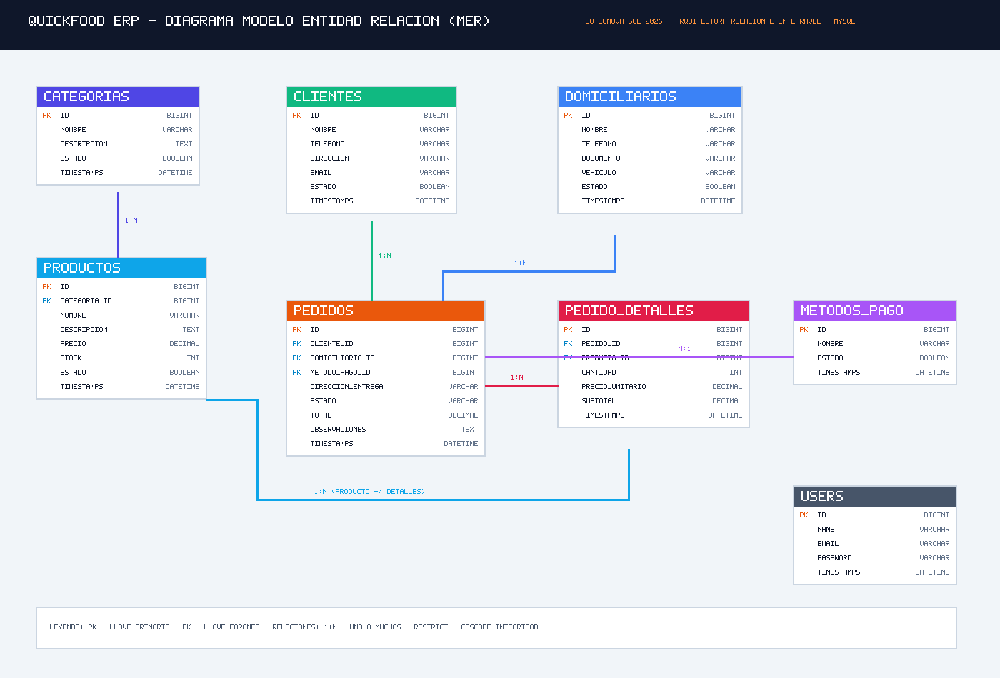
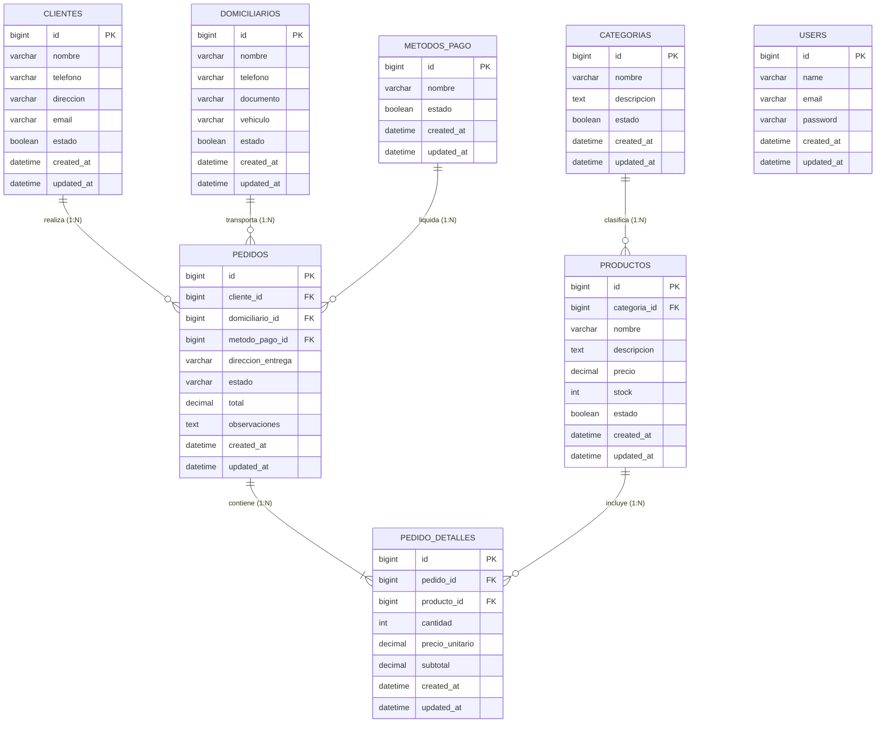

# Diagrama Entidad - Relación (MER): QuickFood ERP
## Software de Gestión Empresarial (SGE) &bull; Cotecnova 2026

A continuación se presenta el modelo relacional del sistema **QuickFood ERP**, implementado mediante migraciones en Laravel con base de datos MySQL 8.4.

---

### Especificación en Notación Mermaid

---

### Cardinalidad y Relaciones Eloquent Implementadas

1. **`Categoria` 1 : N `Producto`**
   * Eloquent: `$this->hasMany(Producto::class)` / Inversa: `$this->belongsTo(Categoria::class)`.
   * Regla DB: Clave foránea `categoria_id` en `productos` apuntando a `categorias(id)`.
2. **`Cliente` 1 : N `Pedido`**
   * Eloquent: `$this->hasMany(Pedido::class)` / Inversa: `$this->belongsTo(Cliente::class)`.
   * Regla DB: Clave foránea `cliente_id` en `pedidos` apuntando a `clientes(id)`.
3. **`Domiciliario` 1 : N `Pedido`**
   * Eloquent: `$this->hasMany(Pedido::class)` / Inversa: `$this->belongsTo(Domiciliario::class)`.
   * Regla DB: Clave foránea `domiciliario_id` (nullable) en `pedidos` con `ON DELETE SET NULL`.
4. **`MetodoPago` 1 : N `Pedido`**
   * Eloquent: `$this->hasMany(Pedido::class)` / Inversa: `$this->belongsTo(MetodoPago::class)`.
   * Regla DB: Clave foránea `metodo_pago_id` en `pedidos` con `RESTRICT` en eliminación.
5. **`Pedido` 1 : N `PedidoDetalle`**
   * Eloquent: `$this->hasMany(PedidoDetalle::class)` / Inversa: `$this->belongsTo(Pedido::class)`.
   * Regla DB: Clave foránea `pedido_id` en `pedido_detalles` con `ON DELETE CASCADE`.
6. **`Producto` 1 : N `PedidoDetalle`**
   * Eloquent: `$this->hasMany(PedidoDetalle::class)` / Inversa: `$this->belongsTo(Producto::class)`.
   * Regla DB: Clave foránea `producto_id` en `pedido_detalles` con `RESTRICT` en eliminación.
